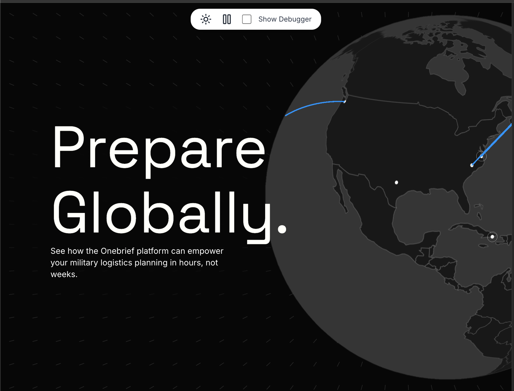
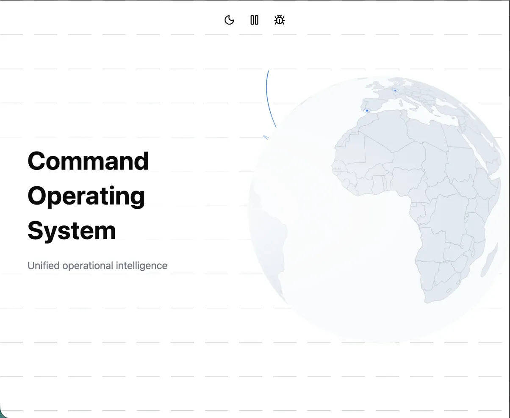
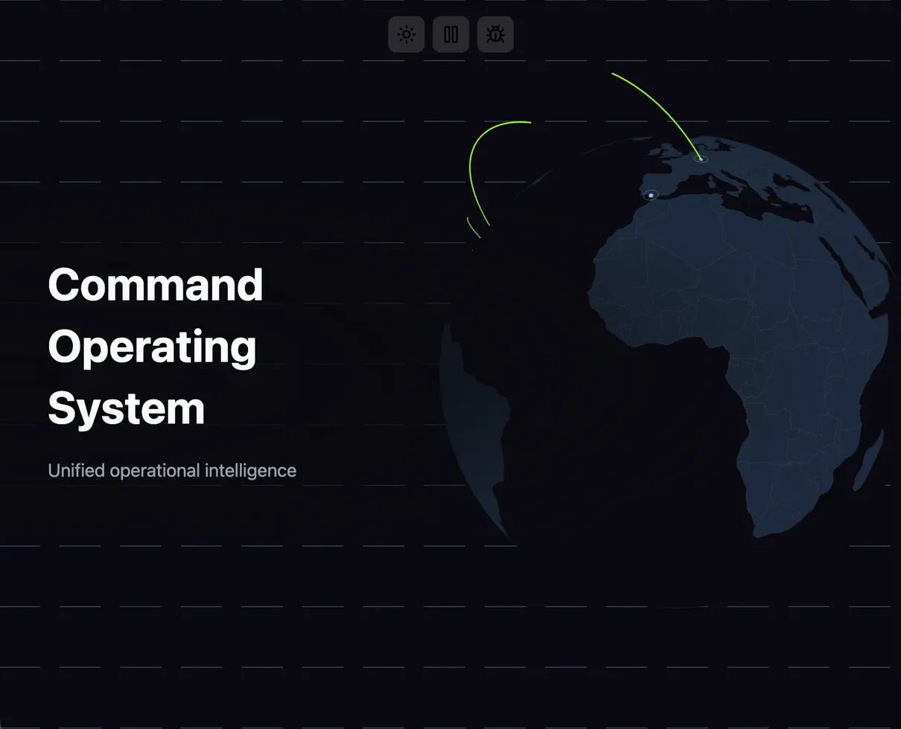

# Onebrief Hero — Ambient Motion Prototype

A globe-based ambient motion element for Onebrief's marketing header, visualizing global military logistics operations.



## Intent & Brand Rationale

Onebrief is military planning software — precision, global reach, and operational clarity. Rather than abstract gradients or particles, I leaned into their actual domain: **a globe showing logistics flows between military installations**.

The feeling: _calm confidence in complex operations_. Arcs pulse outward from hub bases in staggered waves (Norfolk → Ramstein, Pearl Harbor → Yokota), suggesting coordinated global movement without being frenetic. The vector field on desktop subtly tracks the mouse, adding life without demanding attention.

## Technical Approach

| Layer        | Tech                            | Why                                                   |
| ------------ | ------------------------------- | ----------------------------------------------------- |
| Globe        | `react-globe.gl` + Three.js     | Hardware-accelerated, handles arcs/rings natively     |
| Texture      | Canvas 2D → equirectangular PNG | Dynamic generation from GeoJSON, base points baked in |
| Vector field | SVG                             | Lightweight, no WebGL overhead for simple lines       |
| Controls     | Leva                            | Debug panel for real-time color tuning                |
| Framework    | React 18 + TypeScript + Vite    | Fast builds, type safety                              |

**Key decisions:**

- **Baked texture** — Countries + base points rendered once to Canvas, avoiding per-frame geometry
- **Staggered arc timing** — `arcDashInitialGap` creates cascading "dispatch" effect
- **Dual-theme Leva folders** — Light/Dark colors exposed simultaneously for design iteration
- **`globeOffset`** — Globe fills viewport but is offset right (desktop) or down (mobile), text overlays left

## AI Usage

I came in with a technology game plan (react-globe.gl, Leva, Vite) and directed Claude to fetch key references — Onebrief's website for design tokens, GitHub globe examples, library docs. Providing this structured research approach improved Claude's execution accuracy at each step.

I refined the implementation plan through 50+ messages with Claude as a research and drafting assistant — I drove architecture decisions (CSS grid vs. globeOffset, static vs. dynamic textures, Leva folder structure) while Claude handled API research, documentation synthesis, and document formatting.

View the implementation plan passed to Claude Code: [`IMPLEMENTATION_PLAN.md`](./IMPLEMENTATION_PLAN.md)

**Initial prompt:**

> I want to create a reacts/ts header component called OnebriefHero.tsx. At this point we are not going into full solution mode, we are just gaining a coherent understanding of requirements and researching best paths forward.
>
> Lets consider the following requirements:
>
> - A single drop-in component with a multi layer approach:
>
>   - Hero content overlay: main text, subtext
>
>     - Left aligned text
>
>     - Each line of the main text appears on it's own line and is separated by 12px space (line-height or padding is fine for spacing) to give more control over the spacing and layout
>
>   - Three.js scene layer: Globe slowly rotating and showing animated arcs from different military bases in a pattern.
>
>     - Minimal uniform styling to give a "drawn" look to the globe that resembles tactical diagrams. The globe material should be a MeshBasicMaterial so that it doesn't respond to light in the scene. We should remove all unneeded lights from the scene.
>
>     - Show the outline of countries
>
>     - Show an emanating ring animation of the bases so that they appear to be sending out communication - three pulses
>
>   - Vector pattern layer: I want to show an svg based vector field of short gray lines resembling something like a disjointed hitch pattern.
>
>     - Initially all vectors will point towards the globe to emphasize global focus
>
>     - All vectors orient to point towards the mouse position
>
>     - For the hero content, there should be a radial background gradient that goes from background color out to fully transparent at the edges. This will prevent the text from being illegible due to the vector pattern.
>
> - Controls: A controls component in the top center that shows a button to configure light/dark mode, play/pause animation, show debugger
>
>   - I need to include a light mode and a dark mode
>
>   - I need to be able to pause the animations for the globe
>
>   - I want to use leva to control variables (show if debugger=true). Each of the below would need both light and dark mode variants for each listed variable
>
>     - Globe
>
>       - Globe base color
>
>       - Globe base ring color
>
>       - Globe land color
>
>       - Globe country border color
>
>       - Globe sea color
>
>       - Globe arc color
>
>     - Vectors
>
>       - Vector color
>
>   - I need the ability to view stats via three/examples/jsm/libs/stats.module.js (show if debugger = true) for checking performance)
>
> Technologies:
>
> - I want to use the latest version of vite with react/tsx
>
> - I want to style using tailwind
>
> Open Questions:
>
> - I'm stuck between using AWS Amplify or Vercel to send this demo out. Which is the better option for me? I haven't used Vercel but if it can save me time and is easy to setup it's a go for me.
>
> Topics for web lookup:
>
> - Find me the top 15 US military bases and provide the data back in a JSON array of {"name": ..., "lat":..., "lng": ....} for each entry
>
> - What might a couple of patterns for shipments from one facility to another look like for these bases? Imagining that they would start in one place and then disperse out to other bases
>
> - Find the latest instructions for creating a new project using vite
>
> Fetch task:
>
> - Look at https://www.onebrief.com/platform and look at the patterns for their Hero components. Also look at their CSS variables. Bring me back information around the font family, font size, font color, and colors that will match their visual language. Less is more here. I just need those details put into a tokens.css file.
>
> Topics for deep research
>
> - Explore the suitability of react-globe.gl for the globe layer: https://github.com/vasturiano/react-globe.gl. I've used this in the past but want to ensure this is still the best approach. While not necessarily lightweight I believe we could justify this by unpacking whatever is necessary and executing in pure three.js later for a final approach if seeing performance degradation. Please see if there are better alternatives out there.
>
> Next steps:
>
> - Ask any clarifying questions around the requirements if you have any or if you see any gaps
>
> - Help me think through the open questions
>
> - Create me an ImplementationPlan artifact. This document will include the steps to execute and each step will include a reference to a corresponding "Task Context section in the document". As we solidify the vision, and complete research tasks, please update this document.
>
>   - Example Task: Set up project to use tailwind.css and to provide light mode/dark mode theme options. Create a useTheme hook that lets us change a data-theme attribute at the document root.
>
>   - Example Task Context: https://tailwindcss.com/docs/installation/using-vite, https://tailwindcss.com/docs/adding-custom-styles
>
> Lets start working through the next steps together.

**Claude Code initial output:**

After passing the implementation plan to Claude Code, the first working build produced:




Globe rendering, arc animations, vector field, theme toggle, and controls all functional on first pass. From here I iterated on visual polish and edge cases. I ended up restructuring project folders quite a bit and abstracting logic into hooks for easier maintenance.

AI accelerated research, planning, and boilerplate; judgment calls (brand direction, visual hierarchy, what to cut) and final polish and optimizations were mine.

## Performance & Accessibility

**Performance:**

- Single texture regeneration on color change (100ms debounce)
- Only arcs + rings are animated geometry; points are static in texture
- Vector field hidden on mobile (< 768px)
- No continuous repaints when idle

**Accessibility:**

- Pause button stops all animation
- `prefers-reduced-motion` respected (disables auto-rotation, arc animation)
- Globe is decorative (`aria-hidden`), content remains in DOM
- Theme toggle for light/dark contexts

## What I'd Productionize Next

1. **CMS integration** — Arc routes configurable by marketing team, not hardcoded
2. **Hover tooltips** — Base names, route info on arc hover
3. **Mobile optimization** — Smaller texture resolution, simplified globe
4. **Reduced motion fallback** — Static globe snapshot instead of hidden
5. **Reduce bundle size** — Extract only needed code from react-globe.gl, drop unused features

---

**Run locally:**

```bash
npm install && npm run dev
```

Requires Node 18+.

Built in ~2 hours. Debug mode (top-right toggle) exposes Leva panel + FPS counter.
